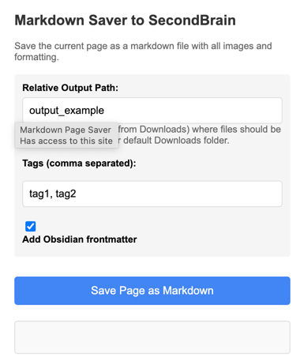

# Markdown Page Saver Chrome Extension for "Second Brain"

A Chrome extension for saving web pages as Markdown with images, built with TypeScript.



## Features

- Save any web page as a Markdown file
- Automatically download all images from the page
- Organize downloads in a folder structure
- Configure download location
- Add Obsidian-compatible YAML frontmatter
- Customize tags for saved pages
- Simple one-click interface
- Works on any website
- Context menu integration

## Development Setup

1. Install dependencies:
   ```
   npm install
   ```

2. Build the extension:
   ```
   npm run build
   ```

3. Load the extension in Chrome:
   - Open Chrome and navigate to `chrome://extensions/`
   - Enable "Developer mode"
   - Click "Load unpacked" and select the `dist` folder

## Project Structure

- `src/`: Source TypeScript files
  - `background.ts`: Background script
  - `content.ts`: Content script injected into web pages
  - `popup.ts`: Script for the extension popup
  - `popup.html`: HTML for the extension popup
  - `manifest.json`: Extension manifest file
  - `icons/`: Extension icons
- `dist/`: Compiled JavaScript and assets (generated)

## How It Works

1. When you click the extension icon, it activates the popup
2. Enter your preferred download path (absolute path)
3. Add custom tags for the page (optional)
4. Toggle Obsidian frontmatter on/off
5. Click "Save Page as Markdown" to start the process
6. The content script extracts the page content and converts it to Markdown
7. The content script also collects all images on the page
8. The extension creates a folder with the page title
9. The markdown file and all images are saved in this folder

## Obsidian Frontmatter

The extension adds Obsidian-compatible YAML frontmatter to the top of each markdown file:

```yaml
---
title: Page Title
description: Page description from meta tags
tags:
  - web-clipping
  - your-custom-tag
published: true
date: YYYY-MM-DD
---
```

## License

ISC
